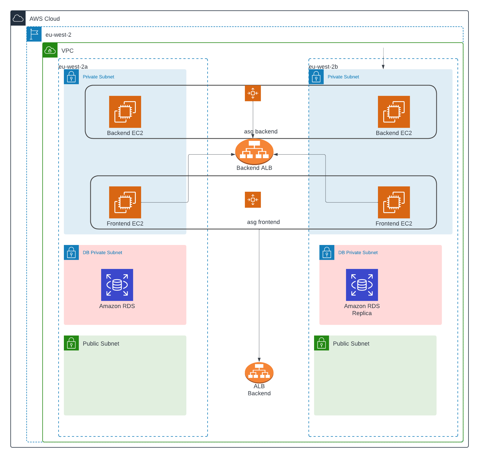

<!-- BEGIN_TF_DOCS -->
# 3-tier application Demo

## Technical Overview

Welcome to the technical documentation for your inaugural AWS project! In this phase, you will be orchestrating a 3-tier application within your internal AWS Organization using Terraform as the Infrastructure as Code (IaC) tool. The architecture comprises 2 frontend machines, 2 backend machines, and 2 databases, meticulously configured in a multi-AZ (Availability Zone) setup. The application's gateway is facilitated through an Application Load Balancer (ALB) residing in a public subnet, while all machines, including frontends and backends, are strategically positioned in private subnets. An additional internal Load Balancer (LB) will be integral for secure communication between the tiers.

## Project Components

### Frontend
- Node.js application running on 2 machines.
- Deployed using Auto Scaling Groups (ASG) for scalability.
- Utilizes custom Amazon Machine Images (AMIs).
- Exposed on ports 3000.
- Machines situated in private subnets.

### Backend
- Python Flask application running on 2 machines.
- Deployed using Auto Scaling Groups (ASG) for scalability.
- Utilizes custom Amazon Machine Images (AMIs).
- Operating on ports 5000.
- Machines positioned in private subnets.

### Databases
- 2 databases deployed in a multi-AZ configuration.
- Utilizes one master and one replica instance.
- Specific database configurations are to be customized.

### Load Balancers
- External ALB for public access.
- Internal LB to manage communication between tiers.

## Setup Instructions

Follow the precise steps below to set up the project:

1. Clone the repository:
   ```bash
   git clone https://github.com/orasraf12/3-tier-application-Demo.git
   cd 3-tier-application-Demo/terraform

2. Initialize Terraform:
   ```bash
   terraform init 

3. Review and modify variables in terraform.tfvars file.

4. Deploy the infrastructure:
   ```bash 
   terraform apply 
   # Enter your database password when prompted


## Accessing the Application 
   Access the application through the public URL provided by the ALB.
   Access the EC2 machines using Session Manager. 


## Providers

| Name | Version |
|------|---------|
| <a name="provider_aws"></a> [aws](#provider\_aws) | 5.38.0 |

## Modules

| Name | Source | Version |
|------|--------|---------|
| <a name="module_backend_asg"></a> [backend\_asg](#module\_backend\_asg) | terraform-aws-modules/autoscaling/aws | n/a |
| <a name="module_frontend_asg"></a> [frontend\_asg](#module\_frontend\_asg) | terraform-aws-modules/autoscaling/aws | n/a |
| <a name="module_vpc"></a> [vpc](#module\_vpc) | terraform-aws-modules/vpc/aws | ~> 5.0 |

## Resources

| Name | Type |
|------|------|
| [aws_autoscaling_attachment.asg_to_alb_backend](https://registry.terraform.io/providers/hashicorp/aws/latest/docs/resources/autoscaling_attachment) | resource |
| [aws_autoscaling_attachment.asg_to_alb_frontend](https://registry.terraform.io/providers/hashicorp/aws/latest/docs/resources/autoscaling_attachment) | resource |
| [aws_db_instance.mysql-rds](https://registry.terraform.io/providers/hashicorp/aws/latest/docs/resources/db_instance) | resource |
| [aws_db_instance.replica-mysql-rds](https://registry.terraform.io/providers/hashicorp/aws/latest/docs/resources/db_instance) | resource |
| [aws_db_subnet_group.db_subnet_group](https://registry.terraform.io/providers/hashicorp/aws/latest/docs/resources/db_subnet_group) | resource |
| [aws_lb.application-lb_frontend](https://registry.terraform.io/providers/hashicorp/aws/latest/docs/resources/lb) | resource |
| [aws_lb.application_lb_backend](https://registry.terraform.io/providers/hashicorp/aws/latest/docs/resources/lb) | resource |
| [aws_lb_listener.alb-listener](https://registry.terraform.io/providers/hashicorp/aws/latest/docs/resources/lb_listener) | resource |
| [aws_lb_listener.alb_listener_backend](https://registry.terraform.io/providers/hashicorp/aws/latest/docs/resources/lb_listener) | resource |
| [aws_lb_target_group.target_group_backend](https://registry.terraform.io/providers/hashicorp/aws/latest/docs/resources/lb_target_group) | resource |
| [aws_lb_target_group.target_group_fronted](https://registry.terraform.io/providers/hashicorp/aws/latest/docs/resources/lb_target_group) | resource |
| [aws_route53_record.backend](https://registry.terraform.io/providers/hashicorp/aws/latest/docs/resources/route53_record) | resource |
| [aws_route53_record.database](https://registry.terraform.io/providers/hashicorp/aws/latest/docs/resources/route53_record) | resource |
| [aws_route53_record.frontend](https://registry.terraform.io/providers/hashicorp/aws/latest/docs/resources/route53_record) | resource |
| [aws_route53_zone.private](https://registry.terraform.io/providers/hashicorp/aws/latest/docs/resources/route53_zone) | resource |
| [aws_security_group.backend-server](https://registry.terraform.io/providers/hashicorp/aws/latest/docs/resources/security_group) | resource |
| [aws_security_group.lb_sg](https://registry.terraform.io/providers/hashicorp/aws/latest/docs/resources/security_group) | resource |
| [aws_security_group.rds_sg](https://registry.terraform.io/providers/hashicorp/aws/latest/docs/resources/security_group) | resource |

## Inputs

| Name | Description | Type | Default | Required |
|------|-------------|------|---------|:--------:|
| <a name="input_aws_lb_listener_type"></a> [aws\_lb\_listener\_type](#input\_aws\_lb\_listener\_type) | the type of the aws\_lb\_listener | `string` | `"forward"` | no |
| <a name="input_azs"></a> [azs](#input\_azs) | A list of availability zones names or ids in the region | `list(string)` | <pre>[<br>  "eu-west-2a",<br>  "eu-west-2b"<br>]</pre> | no |
| <a name="input_backend_ami"></a> [backend\_ami](#input\_backend\_ami) | n/a | `string` | `"ami-04e1ec573bbbafba8"` | no |
| <a name="input_backend_asg"></a> [backend\_asg](#input\_backend\_asg) | n/a | `string` | `"backend-asg"` | no |
| <a name="input_backend_asg_desired_capacity"></a> [backend\_asg\_desired\_capacity](#input\_backend\_asg\_desired\_capacity) | n/a | `number` | `2` | no |
| <a name="input_backend_asg_max_size"></a> [backend\_asg\_max\_size](#input\_backend\_asg\_max\_size) | n/a | `number` | `4` | no |
| <a name="input_backend_asg_min_szie"></a> [backend\_asg\_min\_szie](#input\_backend\_asg\_min\_szie) | n/a | `number` | `2` | no |
| <a name="input_backend_asg_wait_for_capacity_timeout"></a> [backend\_asg\_wait\_for\_capacity\_timeout](#input\_backend\_asg\_wait\_for\_capacity\_timeout) | n/a | `number` | `0` | no |
| <a name="input_backend_instance_type"></a> [backend\_instance\_type](#input\_backend\_instance\_type) | n/a | `string` | `"t3.micro"` | no |
| <a name="input_backend_name"></a> [backend\_name](#input\_backend\_name) | name fo the backend | `string` | `"backend"` | no |
| <a name="input_cidr"></a> [cidr](#input\_cidr) | VPC CIDR Block | `string` | `"10.0.0.0/16"` | no |
| <a name="input_create_database_subnet_group"></a> [create\_database\_subnet\_group](#input\_create\_database\_subnet\_group) | VPC Create Database Subnet Group, Controls if database subnet group should be created | `bool` | `true` | no |
| <a name="input_create_database_subnet_route_table"></a> [create\_database\_subnet\_route\_table](#input\_create\_database\_subnet\_route\_table) | VPC Create Database Subnet Route Table, Controls if separate route table for database should be created | `bool` | `true` | no |
| <a name="input_database_subnets"></a> [database\_subnets](#input\_database\_subnets) | A list of database subnets inside the VPC | `list(string)` | <pre>[<br>  "10.0.151.0/24",<br>  "10.0.152.0/24"<br>]</pre> | no |
| <a name="input_db_engine"></a> [db\_engine](#input\_db\_engine) | type of the db engine for example mysql or postgress etc... | `string` | `"mysql"` | no |
| <a name="input_db_engine_version"></a> [db\_engine\_version](#input\_db\_engine\_version) | version of the db engine | `string` | `"5.7"` | no |
| <a name="input_db_instance_type"></a> [db\_instance\_type](#input\_db\_instance\_type) | the db instance type | `string` | `"db.t3.micro"` | no |
| <a name="input_db_name"></a> [db\_name](#input\_db\_name) | database name | `string` | `"backend"` | no |
| <a name="input_db_pass"></a> [db\_pass](#input\_db\_pass) | password of the database live it empty and enter when you create | `string` | n/a | yes |
| <a name="input_db_user"></a> [db\_user](#input\_db\_user) | user name for the data base | `string` | `"root"` | no |
| <a name="input_enable_nat_gateway"></a> [enable\_nat\_gateway](#input\_enable\_nat\_gateway) | Should be true if you want to provision NAT Gateways for each of your private networks | `bool` | `true` | no |
| <a name="input_frontend_ami"></a> [frontend\_ami](#input\_frontend\_ami) | n/a | `string` | `"ami-0e6c17d28dc6c4208"` | no |
| <a name="input_frontend_asg_desired_capacity"></a> [frontend\_asg\_desired\_capacity](#input\_frontend\_asg\_desired\_capacity) | n/a | `number` | `2` | no |
| <a name="input_frontend_asg_max_size"></a> [frontend\_asg\_max\_size](#input\_frontend\_asg\_max\_size) | n/a | `number` | `4` | no |
| <a name="input_frontend_asg_min_szie"></a> [frontend\_asg\_min\_szie](#input\_frontend\_asg\_min\_szie) | n/a | `number` | `2` | no |
| <a name="input_frontend_asg_name"></a> [frontend\_asg\_name](#input\_frontend\_asg\_name) | frontend vars | `string` | `"frontend-asg"` | no |
| <a name="input_frontend_asg_wait_for_capacity_timeout"></a> [frontend\_asg\_wait\_for\_capacity\_timeout](#input\_frontend\_asg\_wait\_for\_capacity\_timeout) | n/a | `number` | `0` | no |
| <a name="input_frontend_instance_type"></a> [frontend\_instance\_type](#input\_frontend\_instance\_type) | n/a | `string` | `"t3.micro"` | no |
| <a name="input_frontend_name"></a> [frontend\_name](#input\_frontend\_name) | The name fo the frontend env for DNS | `string` | `"frontend"` | no |
| <a name="input_ip_address_type"></a> [ip\_address\_type](#input\_ip\_address\_type) | the type of the ip address ipv4 or ipv6 | `string` | `"ipv4"` | no |
| <a name="input_load_balancer_internal"></a> [load\_balancer\_internal](#input\_load\_balancer\_internal) | the ttype of LB application, nework etc... | `bool` | `false` | no |
| <a name="input_load_balancer_type"></a> [load\_balancer\_type](#input\_load\_balancer\_type) | the ttype of LB application, nework etc... | `string` | `"application"` | no |
| <a name="input_port_backend"></a> [port\_backend](#input\_port\_backend) | port number of the backend app | `number` | `5000` | no |
| <a name="input_port_database"></a> [port\_database](#input\_port\_database) | port number of the database app | `number` | `3306` | no |
| <a name="input_port_frontend"></a> [port\_frontend](#input\_port\_frontend) | port number of the frontend app | `number` | `3000` | no |
| <a name="input_port_http"></a> [port\_http](#input\_port\_http) | port number of the database app | `number` | `80` | no |
| <a name="input_private_subnets"></a> [private\_subnets](#input\_private\_subnets) | A list of private subnets inside the VPC | `list(string)` | <pre>[<br>  "10.0.1.0/24",<br>  "10.0.2.0/24"<br>]</pre> | no |
| <a name="input_protocol_http"></a> [protocol\_http](#input\_protocol\_http) | http protocol for sg and helthchecks | `string` | `"HTTP"` | no |
| <a name="input_protocol_tcp"></a> [protocol\_tcp](#input\_protocol\_tcp) | tcp protocol name for sg and helthchecks | `string` | `"tcp"` | no |
| <a name="input_public_subnets"></a> [public\_subnets](#input\_public\_subnets) | A list of public subnets inside the VPC | `list(string)` | <pre>[<br>  "10.0.101.0/24",<br>  "10.0.102.0/24"<br>]</pre> | no |
| <a name="input_region"></a> [region](#input\_region) | Region in which AWS Resources to be created | `string` | `"eu-west-2"` | no |
| <a name="input_sg_cidr"></a> [sg\_cidr](#input\_sg\_cidr) | all to ip range | `list(string)` | <pre>[<br>  "0.0.0.0/0"<br>]</pre> | no |
| <a name="input_single_nat_gateway"></a> [single\_nat\_gateway](#input\_single\_nat\_gateway) | Should be true if you want to provision a single shared NAT Gateway across all of your private networks | `bool` | `true` | no |
| <a name="input_tags"></a> [tags](#input\_tags) | ############################################## Tags ##################################### | `map(string)` | <pre>{<br>  "Created By": "orasraf@terasky.com",<br>  "Env": "stage",<br>  "Purpose": "learning",<br>  "terraform": "true"<br>}</pre> | no |
| <a name="input_target_type"></a> [target\_type](#input\_target\_type) | The type for target group | `string` | `"instance"` | no |
| <a name="input_vpc_name"></a> [vpc\_name](#input\_vpc\_name) | VPC Name | `string` | `"vpc"` | no |

## Outputs

| Name | Description |
|------|-------------|
| <a name="output_azs"></a> [azs](#output\_azs) | A list of availability zones specified as argument to this module |
| <a name="output_nat_public_ips"></a> [nat\_public\_ips](#output\_nat\_public\_ips) | List of public Elastic IPs created for AWS NAT Gateway |
| <a name="output_private_subnets"></a> [private\_subnets](#output\_private\_subnets) | A list of private subnets inside the VPC |
| <a name="output_public_subnets"></a> [public\_subnets](#output\_public\_subnets) | A list of public subnets inside the VPC |
| <a name="output_vpc_cidr_block"></a> [vpc\_cidr\_block](#output\_vpc\_cidr\_block) | The CIDR block of the VPC |
| <a name="output_vpc_id"></a> [vpc\_id](#output\_vpc\_id) | The ID of the VPC |
<!-- END_TF_DOCS -->